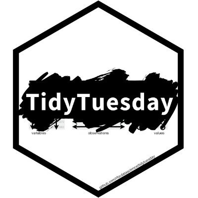
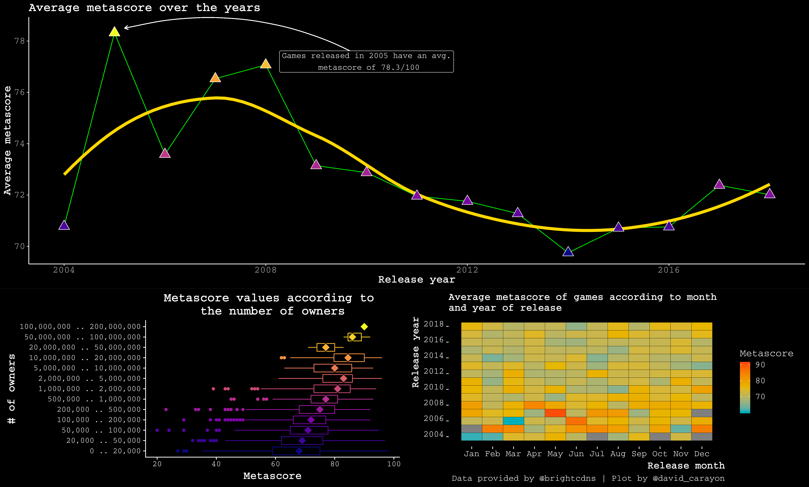
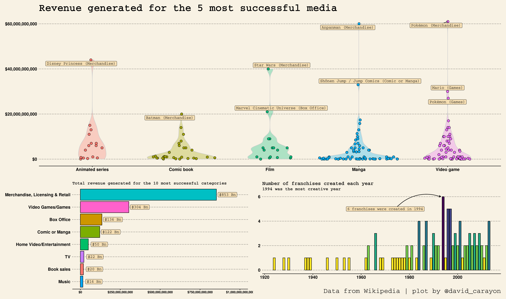

# #TidyTuesday Contributions 

&nbsp;&nbsp;&nbsp;:e-mail: [Email][Email]&nbsp;&nbsp;&nbsp;|&nbsp;&nbsp;&nbsp;:speech_balloon: [Twitter][Twitter]&nbsp;&nbsp;&nbsp;|&nbsp;&nbsp;&nbsp;:necktie: [LinkedIn][LinkedIn]

<!--
Quick Link
-->
[Twitter]:https://twitter.com/david_carayon
[LinkedIn]:https://www.linkedin.com/in/carayon-david/
[Email]:mailto:david.carayon@inrae.fr

This repos contains my contributions for the #TidyTuesday weekly R challenge. This is a challenge which focusses on understanding how to summarize and arrange data to make meaningful and/or beautiful charts with {ggplot2}, {tidyr}, {dplyr} and other tools that are part of the {tidyverse} ecosystem. You can read all about it and get involved [here](https://github.com/rfordatascience/tidytuesday/blob/master/README.md).

# 2020

- Week 45 : **IKEA furniture** : :computer:[code](https://github.com/davidcarayon/TidyTuesdaySubmissions/blob/master/R/2020_45_ikea.Rmd) |:bar_chart: [HTML preview](https://htmlpreview.github.io/?https://github.com/davidcarayon/TidyTuesdaySubmissions/blob/master/html/2020_45_ikea.html)

# 2019

- Bob Ross's paintings : :computer: [Code](https://github.com/davidcarayon/TidyTuesdaySubmissions/blob/master/R/2019_32_bob_ross.R) | :bar_chart: [Plot]((https://github.com/davidcarayon/TidyTuesdaySubmissions/blob/master/plots/2019/bob_ross_tidytuesday.png))

## Video Games Dataset

[Code here](https://github.com/davidcarayon/TidyTuesdaySubmissions/blob/master/R/2019_31_video_games.R)

## Media Franchise Revenues

[Code here](https://github.com/davidcarayon/TidyTuesdaySubmissions/blob/master/R/2019_27_media.R)

## Meteorite crashes

[Code here](https://github.com/davidcarayon/TidyTuesdaySubmissions/blob/master/R/2019_24_meteorites.R)

