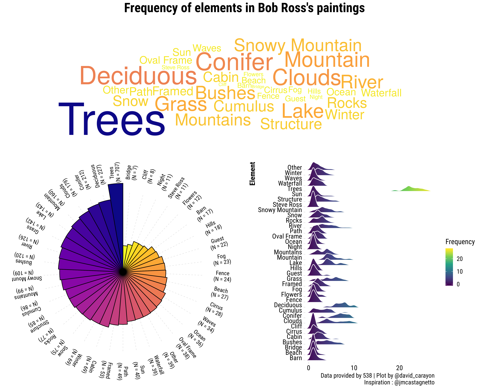
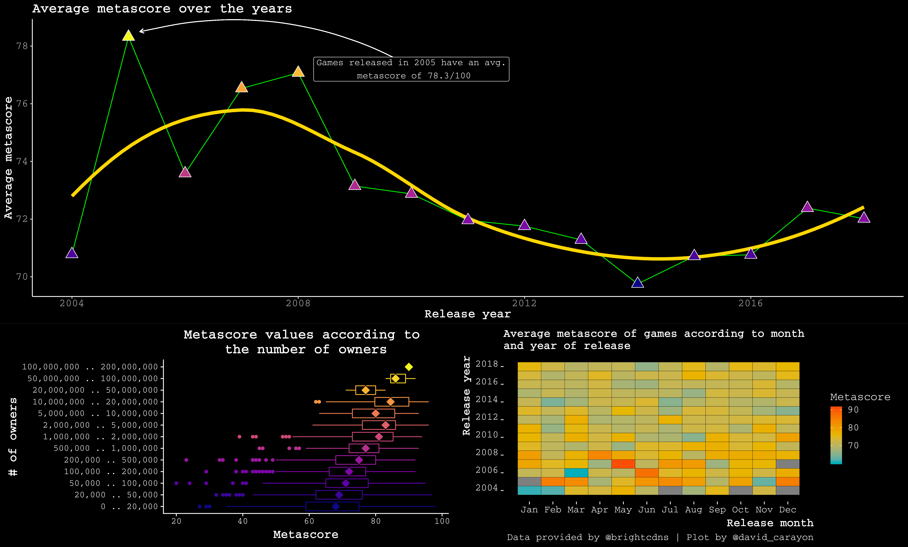
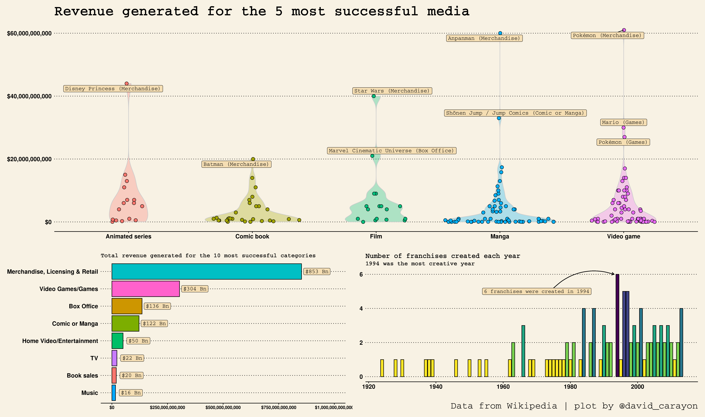
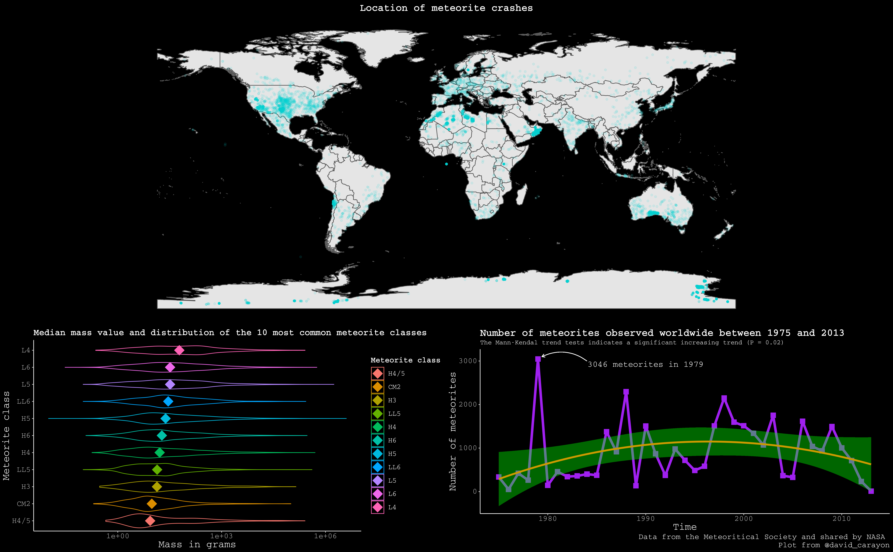

<h1 style="font-weight:normal" align="center">
  &nbsp;#TidyTuesday Contributions&nbsp;
</h1>

&nbsp;&nbsp;&nbsp;:e-mail: [Email][Email]&nbsp;&nbsp;&nbsp;|&nbsp;&nbsp;&nbsp;:speech_balloon: [Twitter][Twitter]&nbsp;&nbsp;&nbsp;|&nbsp;&nbsp;&nbsp;:necktie: [LinkedIn][LinkedIn]

<!--
Quick Link
-->
[Twitter]:https://twitter.com/david_carayon
[LinkedIn]:https://www.linkedin.com/in/carayon-david/
[Email]:mailto:david.carayon@inrae.fr

This repos contains my contributions for the #TidyTuesday weekly R challenge. This is a challenge which focusses on understanding how to summarize and arrange data to make meaningful and/or beautiful charts with {ggplot2}, {tidyr}, {dplyr} and other tools that are part of the {tidyverse} ecosystem. You can read all about it and get involved [here](https://github.com/rfordatascience/tidytuesday/blob/master/README.md).

## Bob Ross's paintings - Week 32

## Video Games Dataset - Week 31

## Media Franchise Revenues - Week 27

## Meteorite crashes - Week 24

